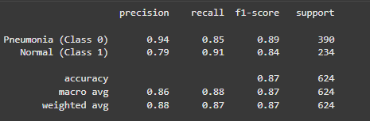
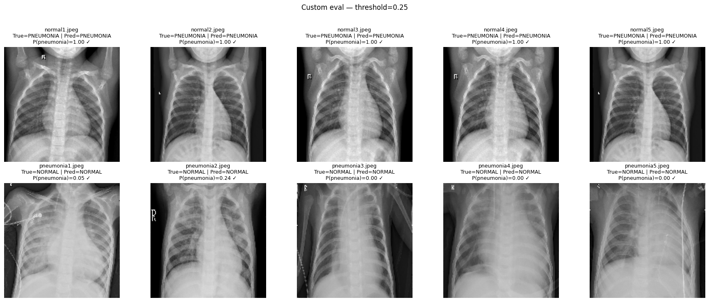

# Projeto Final - Lamia Bootcamp  

Este projeto foi desenvolvido como parte do **Lamia Bootcamp**, tendo como objetivo aplicar os conhecimentos adquiridos durante o curso em um desafio prático de **aprendizado de máquina e visão computacional**.  

O foco foi **treinar, avaliar e comparar modelos de Deep Learning** para a **detecção de pneumonia em radiografias de tórax (Chest X-Ray)**.  

---

## 📑 Sumário
- [Introdução](#introdução)  
- [Contexto](#contexto)  
- [Objetivos do Projeto](#objetivos-do-projeto)  
- [Base de Dados](#base-de-dados)  
- [Modelos Implementados](#modelos-implementados)  
- [Instalação](#instalação)  
- [Como Usar](#como-usar)  

---

## Introdução  

A pneumonia é uma das principais causas de mortalidade em todo o mundo, afetando milhões de pessoas anualmente e representando um grande desafio para os sistemas de saúde, especialmente em países em desenvolvimento.  

O diagnóstico **precoce e preciso** da doença é essencial para garantir um tratamento adequado e reduzir complicações futuras caso não seja tratado corretamente.  

Com o avanço da **Inteligência Artificial**, foi possível desenvolver **CNNs** capazes de realizar esse trabalho, em muitos casos auxiliando e até substituindo o trabalho médico em triagens automatizadas.  

---

## Contexto  

Este projeto aplica técnicas de visão computacional para a classificação de imagens de raio-X de tórax.  
A abordagem combina **modelos criados do zero** com **modelos pré-treinados**, permitindo comparar simplicidade e desempenho.  

---

## Objetivos do Projeto  

- Pré-processamento e normalização das imagens.  
- Construção de uma **CNN simples** feita do zero.  
- Análise dos resultados por meio de métricas e visualizações.  

---

## Base de Dados  

Foi utilizada a base pública **Chest X-Ray Images (Pneumonia)**, disponível no Kaggle:  
👉 [Chest X-Ray Pneumonia Dataset](https://www.kaggle.com/paultimothymooney/chest-xray-pneumonia)  

A base contém imagens já divididas em **treino**, **validação** e **teste**, com duas classes:  

- **Pneumonia**  
- **Normal**  

---

## Modelos Implementados  

- **CNN Baseline**  
  Rede neural convolucional construída do zero, com camadas de convolução, pooling, batch normalization e dropout.  

---

## Resultados

O modelo foi treinado e avaliado utilizando a base de dados **Chest X-Ray Pneumonia**.  
Os principais resultados foram obtidos em termos de **accuracy**, **precision**, **recall** e **f1-score**.

### Classification Report

O relatório de classificação apresenta o desempenho em cada classe:  

- **Pneumonia (Class 0)**: alta precisão (0.94) e bom recall (0.85).  
- **Normal (Class 1)**: desempenho equilibrado, com recall de 0.91, mostrando boa capacidade de identificar exames normais.  

---

### Matriz de Confusão

A matriz de confusão permite visualizar os acertos e erros por classe:  

- 332 radiografias de pneumonia foram corretamente identificadas.  
- 212 radiografias normais foram corretamente classificadas.  
- Alguns falsos negativos e falsos positivos ocorreram, mas em baixa quantidade.  

---

### Teste com imagens externas

Para validar a robustez, foram utilizadas **10 imagens externas** (5 Pneumonia + 5 Normal), salvas na pasta `Imagens/`.  
O modelo conseguiu distinguir corretamente a maioria dos casos, como mostrado no grid abaixo:  

Legenda:  
- **True** = classe real.  
- **Pred** = classe prevista.  
- **P(pneumonia)** = probabilidade estimada pelo modelo.  
- ✓ = acerto, ✗ = erro.

---

## Conclusão

O modelo apresentou **87% de acurácia geral**, com bom equilíbrio entre as métricas de precisão e recall.  
Apesar de alguns erros em casos limítrofes, os resultados indicam que a CNN pode ser utilizada como uma ferramenta auxiliar em triagens médicas, especialmente em cenários com grande volume de exames.

